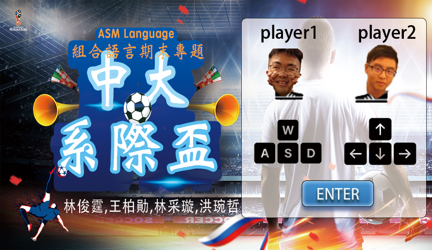
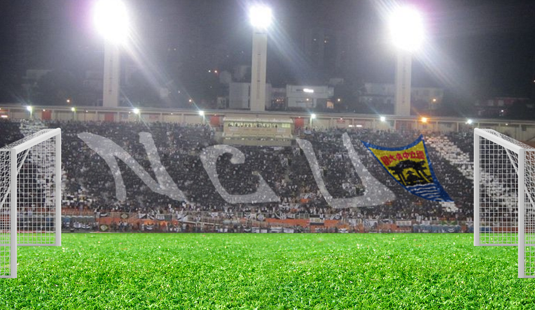
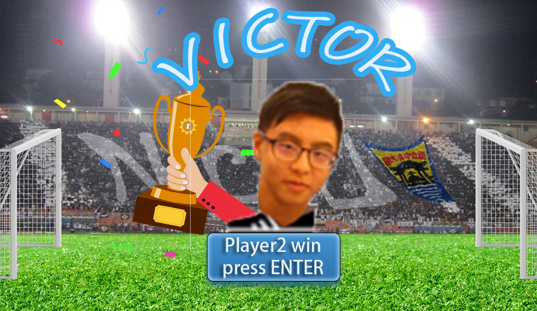
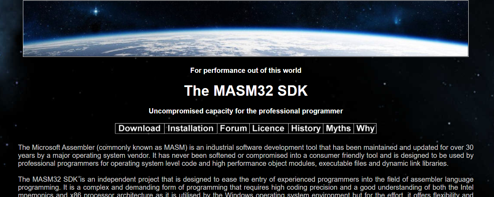
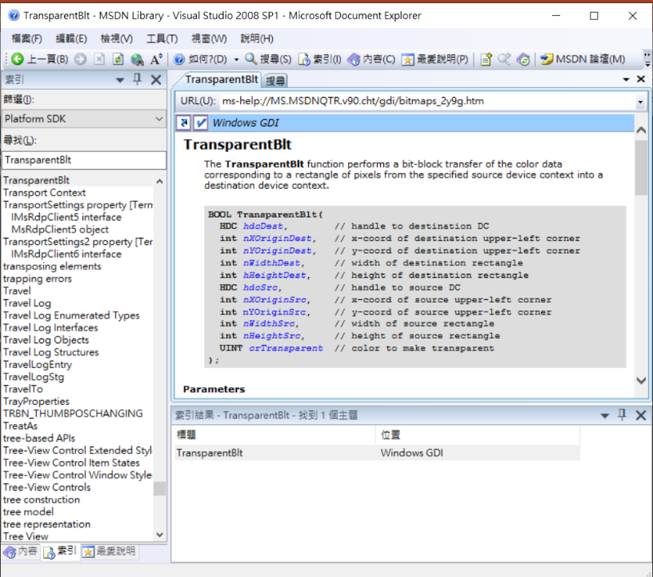
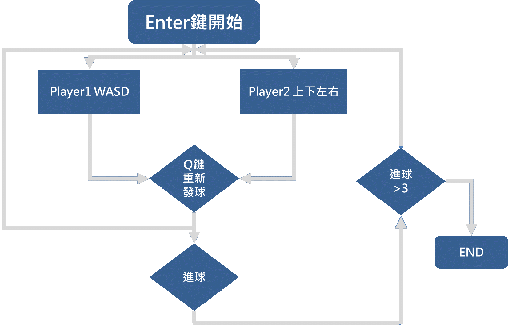
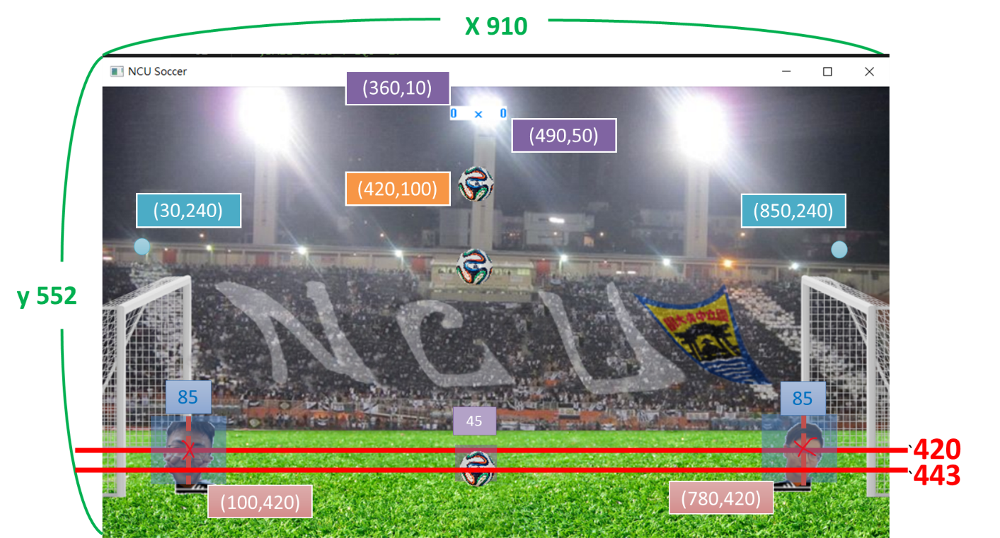

# NCU_soccer_game
## 組合語言期末專題
## 組員名單:
林俊霆109403537&emsp;&emsp;&emsp;王柏勛109403055  
林采璇109403533&emsp;&emsp;&emsp;洪琬哲109403535
## 程式執行截圖
- GameState==1 （歡迎畫面）

- GameState==2 （遊戲畫面）

- GameState==3 （玩家1獲勝畫面）

-	GameState==4 （玩家2獲勝畫面）

## 程式使用函式庫
* 使用Masm32函式庫(user32.lib、kernel32.lib、masm32.lib、msimg32.lib、winmm.lib) 

* 使用查詢工具：MSDN Library for Visual Studio 2008 SP1 繁體中文
  - 因為Masm32為龐大的函式庫，因此我們使用此查詢工具，以知道函式的使用方法與參數等。

## 程式執行流程

## 程式架構
流程圖.jpg)

## 視窗座標圖

## 程式碼說明
### WinMain
- 視窗架構，參考: <a href="https://www.itread01.com/content/1550469815.html">網址點我 </a>
- 設定窗結構體的名稱、設定視窗右上角的名稱、設定視窗大小等。
### WndProc
+ 控制鍵盤的讀入：
  + ENTER： 當在歡迎畫面時，進入遊戲畫面；當在遊戲畫面時，進入歡迎畫面；當在玩家1、玩家2勝利畫面時，進入歡迎畫面。 
  + 當按下按鍵不放時：設keydown：TRUE 
    * 玩家1：
      - 當按著W/space、A、D時，direction 分別設為 0、２、3。若direction不是預設的-1值時，則呼叫changePlayerSpeed，更動玩家速度，再將direction與keydown改回預設值。
      -	當按著E時（射門衝刺，此為專屬於player1的功能），將ultimate_player1變數設為１，供給ballColiding進行條件判斷。
      -	當按著q：發球（重新設定新的xy並發球）
    * 玩家2
      - 當按著上、左、右時，direction分別設為 0、1、3。若direction不是預設的 -1值時，則呼叫changePlayerSpeed，更動玩家速度，再將direction與keydown改回預設值。 
  + 當按鍵鬆手時：設keydown：FALSE
    * 玩家1：
      - 當放開W/space、A、D時，direction 分別設為0、１、3。若direction不是預設的-1值時，則呼叫changePlayerSpeed，更動玩家速度，再將direction與keydown改回預設值。
      - 當放開E時（射門衝刺，此為專屬於player1的功能），將ultimate_player1變數設為１，供給ballColliding進行條件判斷。
    *	玩家2：
        - 當按著上、左、右時，direction 分別設為 0、1、3。若direction不是預設的 -1值時，則呼叫changePlayerSpeed，更動玩家速度，再將direction與keydown改回預設值。

### 一開始的start lable
- 在rsrc.rc這個資料夾裡，存放了圖片的bmp檔，並用數字編號命名，像是100代表background.bmp、101代表menu_image.bmp、1001代表player1.bmp等，所以在主程式裡可以直接令background equ 100、menu equ 101、p1 equ 1001。
### isStopped
- 如果player的x速度和y速度都等於0，令[edx].stopped = 1，代表player會呈現靜止的狀態。

### paintBackground：
-	利用RECT 結構定義了矩形左上角和右下角的坐標，並使用masm32裡的SelectObject函式將指定對象選擇到指定的設備內容（DC） 中，新對象替換相同類型的先前對象。
-	在GAMESTATE == 1時，會顯示menuBmp，也就是遊戲的歡迎畫面。 
在GAMESTATE == 2時，會顯示hBmp，也就是遊戲時的背景。 
在GAMESTATE == 3時，會顯示vitoria1Bmp，也就是player1勝利的畫面。 
在GAMESTATE == 4時，會顯示vitoria2Bmp，也就是player2勝利的畫面。 
-	另外，如果GAMESTATE == 2，畫面上呈現遊戲時的背景的同時，會顯示出一個130 X 40的矩形作為記分板，傳入player1和player2的goals。

###	paintPlayers
-	先呼叫isStopped，讓玩家呈現靜止的狀態。
-	接著透過masm32裡的TransparentBlt函式將去背的圖片根據圖片的pos.x和pos.y放置於視窗，呈現player1、player2以及ball的圖片於畫面上。
###	screenUpdate
-	呼叫masm32裡的BeginPaint函式為繪畫準備指定的窗口，並用有關繪畫的信息填充PAINTSTRUCT結構。
-	呼叫masm32裡的CreateCompatibleDC函式創建與指定設備兼容的內存設備內容（DC）。
-	呼叫paintBackground載入遊戲畫面，如果GAMESTATE == 2，再呼叫paintPlayers，載入玩家和球的圖片。
-	呼叫masm32裡的DeleteDC函式刪除指定的設備內容（DC）。
-	呼叫masm32裡的EndPaint函式標記指定窗口中的繪製結束。每次調用EndPaint函式時都需要此函式，但僅在繪製完成後才需要。

###	changePlayerSpeed
-	若keydown==false，則代表玩家在地平線上。 
若direction == 1則代表按下a 
若direction == 3則代表按下d 
若direction == 0則代表按下w 
將玩家的速度以x座標表示，若玩家碰到兩邊邊界，則將玩家速度設為0。 
-	若keydown==true，則代表玩家在天空中，則需要將玩家的y速度慢慢遞減。

### paintThread
- 若遊戲畫面為1 2 3 4 時，使現在執行續暫停17毫秒，並呼叫InvalidateRect函式，傳入hwnd參數。
### gameManager
- 當判斷GAMESTATE == 2（遊戲狀態=踢球畫面）時，會呼叫movePlayer、ballColliding、moveBall、verifyGoal，並且判斷是任何一位玩家進球數是否已超過MAX_GOALS，假如玩家1達標，宣告玩家1勝利，GAMESTATE設為3（玩家1勝利畫面），反之。
### movePlayer
- 如果玩家鄭在跳躍，每次增加玩家的y速度量（減速）。（ex：-20 -19 -18 直到0）一次跳躍210（大約落在畫面y的一半）。
- 玩家x座標： 
如果玩家在屏幕範圍內(0~890)合法的，我們才需要改變它的位置。pos.x位置+speed.x每次增加的x量，不斷跑回圈，達到水平移動的效果。
- 玩家y座標：
pos.y位置+speed.y每次增加的y量，不斷跑回圈，達到垂直移動的效果。
- 抓取玩家x座標，增加speed_x 的量給x；如果玩家向上跳，我們警告它不能再跳躍，它會“下降”到地面。
### moveBall
- 如果球在空中，我們拉它（重力），每次call這個fucntion，speed.y就會增加1（下降一單位）。
- 如果球碰到地面，讓我們讓它反彈（減三單位，加負號）。（ex：10→-7 →4→-1→0） 
- 球的y座標： 
如果球大於地面我們才需要更動y速度。
- pos.y位置+speed.y每次增加的y量，不斷跑回圈，達到球可以垂直上升下降的效果。
- 球的x座標： 
pos.x位置+speed.x每次增加的x量，不斷跑回圈，達到球可以水平滾的效果。且如果球碰撞到牆壁，則反彈。

###	collide
-	定義什麼較相撞：
  -	判斷玩家的右邊界(obj1Pos.x + 一半的邊長85/2)有沒有大於球的左邊界（obj2Pos.x - 球一半的邊長45/2），edx才為TRUE。
  -	判斷玩家的下邊界(obj1Pos.y + 一半的邊長85/2)有沒有大於球的上邊界（obj2Pos.y - 球一半的邊長45/2），ecx才為TRUE。
- 當edx、ecx接為TRUE時，才定義發生碰撞。

###	ballColliding
- 假如玩家1跟球確實發生碰撞
  -	X速度：
    *	如果玩家是靜止的（玩家被球砸到），則以對方速度的反向射回去。如果玩家在移動（踢球），則根據你的速度踢（根據玩家x的水平速度）。
    *	如果ultimate_player1變數為１時，代表為射門衝刺狀態，速度額外加50。
   -	Y速度：-20 上升
- 假如玩家2跟球確實發生碰撞
  -	X速度：
    * 如果玩家是靜止的（玩家被球砸到），則以對方速度的反向射回去。如果玩家在移動（踢球），則根據你的速度踢（根據玩家x的水平速度）
  - Ｙ速度：-15 上升

###	resetBall：相關內容可參照位置圖
-	使球的速度歸零：speed.x與speed.y。
-	使球回到發球位置：pos.x為420；pos.y為100。
-	resetPositions：相關內容可參照位置圖
-	使player1回到初始位置：pos.x為100；pos.y為420。
-	使player2回到初始位置：pos.x為700；pos.y為420。
-	Invoke resetBall：呼叫resetBall使球的物度歸零並回到發球位置
###	verifyGoal
-	ebx先存取球的位置addrBall，再由eax與ecx分別存取其pos.x與pos.y。edx則為是否進球的旗標，預設為0，當進球後則改為1。
-	判斷得分：判斷eax與ecx中的pos.x與pos.y是否跨過守門點。
  *	若跨過右方守門點（eax > gol2.top.x && ecx > gol2.top.y），則player1得分+1，並呼叫resetPositions使球與球員歸位，再將edx改為1。
  *	同理，跨過左方守門點的情形（eax < gol1.top.x && ecx > gol1.top.y）。
-	當edx為1後，則透過mciSendCommand設置進球音樂。

